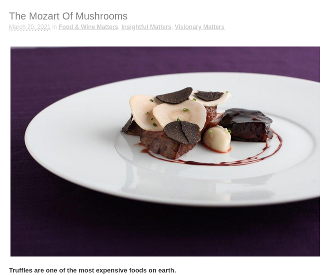
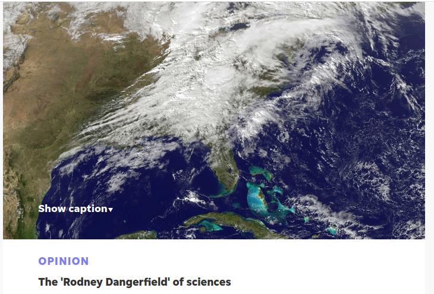
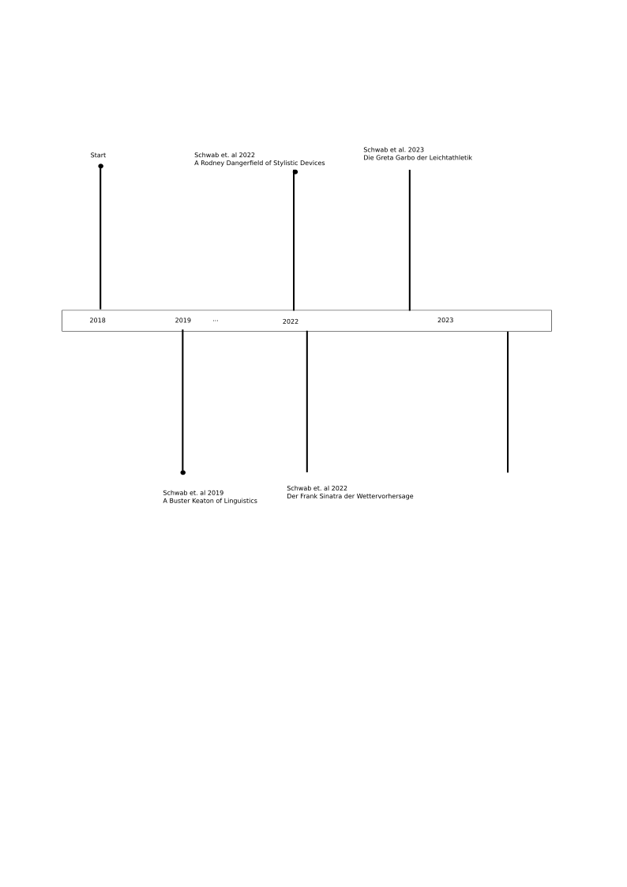

# Vossian Antonomasia <!-- .element: style="font-size:3em;" -->

## Automtatic Detection, Extraction and Analysis 

<br />[Michel Schwab](https://hu.berlin/schwab/)

Humboldt-Universität zu Berlin<!-- .element: style="font-size:0.75em;" -->

<!--<br/> zusammen mit
[Robert Jäschke](https://hu.berlin/RJ/)¹² and	[Frank Fischer](https://lehkost.github.io/)³
<br/>-->

<!--¹ Humboldt-Universität zu Berlin<br/>
² L3S Forschungszentrum Hannover
³ Freie Universität Berlin<br/>-->
<br/> 

<!--<ul>
<li class="web">[vossanto.weltliteratur.net](https://vossanto.weltliteratur.net/)
<li class="doc">Schwab, M., Jäschke, R., Fischer, F., Strötgen, J.: ['A Buster Keaton of Linguistics': First Automated Approaches for the Extraction of Vossian Antonomasia](https://doi.org/10.18653/v1/D19-1647). Proceedings of the 2019 Conference on Empirical Methods in Natural Language Processing. pp. 6239–6244. Association for Computational Linguistics, 2019.
</ul>-->

<!-- keep me, otherwise this gets interpreted as an ordered list --> 09. December 2022


<p>
<a rel="license"
href="http://creativecommons.org/licenses/by/4.0/"></a> <br/>
Dieses Werk ist lizenziert unter einer <a rel="license" href="http://creativecommons.org/licenses/by/4.0/">Creative Commons Namensnennung 4.0 International Lizenz</a>.
</p>

<!-- .element: style="font-size:0.75em; margin-bottom: 0px; margin-top: 5em;" -->

---


## Inhalt

<br />

1. [Defintion and Examples](#/1)
2. [Motivation and Difficulty](#/2)
3. [Data and Methods](#/3)
4. [Evaluation and Analysis](#/4)


---


# Defintion and Examples

--

## Definition

<br />

<!--[portrait of Gerhard Johannes Vossius; source: Wikimedia Commons](images/vossius.jpg)
 .element width="100px" --> 

- named after Dutch scholar Gerardus Vossius (1577–1649)
- a trope, closely related to metaphor and metonymy
- special case of antonomasia (also called metaphorical antonomasia or antonomasia² ([Holmqvist and Pluciennik 2010](https://doi.org/10.1515/9783110230215))
- attributing a particular property to a entity by naming another named entity, that is typically well-known for the respective property
- [Bergien 2013](http://onomasticafelecan.ro/iconn2/proceedings/1_01_Bergien_Angelika_ICONN_2.pdf):

<!-- - typically consists of three parts: -->

<!-- <span class="vasource">Source</span> → <span
  class="vamodifier">Modifier</span> → <span
  class="vatarget">Target</span> (vgl. [Bergien 2013](http://onomasticafelecan.ro/iconn2/proceedings/1_01_Bergien_Angelika_ICONN_2.pdf)) -->
<!-- - Abbreviation: **Vossanto** -->


<!-- - Example: <span class="vatarget"></span>, der <span
  class="vasource"></span> des <span
  class="vamodifier">Computerzeitalters</span> -->


<!-- .element width="450px" -->

<small>
Bildquellen: <a href="https://commons.wikimedia.org/wiki">Wikimedia Commons</a></small>


--


## Examples

<br />

<!-- .element height="400px" --> 

<br />

= Jim Koch (Quelle: [theatlantic.com](https://www.theatlantic.com/magazine/archive/2014/11/the-steve-jobs-of-beer/380790/), 2014)


--

## Examples

<br />

<!-- .element width="400px" -->

<br />

= Tatsuo Horiuchi (Quelle: [theschedio.com](https://theschedio.com/painting-on-excel/), 2020)
 

--

## Examples

<br />

<!-- .element width="400px" -->

<br />

= Truffles (Quelle: [capeinsights.com](https://www.capeinsights.com/the-mozart-of-mushrooms/), 2021)


--

## Examples

<br />

<!-- .element width="400px" -->

<br />

= Modern Meteorology (Quelle: [delawareonline.com](https://eu.delawareonline.com/story/opinion/columnists/1/01/01/the-roger-dangerfield-of-sciences/3663375/))

---

#  Motivation and Difficulty

--

## Motivation

- help to improve other NLP tasks, such as
    - fact extraction
    - machine translation
    - entity disambiguation/co-reference resolution
- provide new interesting question answering tasks
- support creative natural language generation, especially in news and blog articles to generate fruitful content
- a step toward the association of properties and characteristics to entities in text


--

##  Difficulty - semantic understanding

 
<br />

&rarr; requires deep cultural background kowledge

<table>
    <thead>
        <tr>
            <th>VA Phrase </th>
            <th>Explanation</th>
        </tr>
    </thead>
    <tbody>
        <tr>
            <td>the <span class="vasource">Dolly Parton</span> of <span
   class="vamodifier">cakes</span> </td>
            <td>a little bit tacky, but you love her</td>
        </tr>
        <tr>
            <td>the <span class="vasource">Donald Trump</span> of <span
   class="vamodifier">the horse show world</span> </td>
            <td>buying and selling horses like so many pieces of real estate, pocketing a profit and never shedding a tear as she watches her property being trucked away</td>
        </tr>
    </tbody>
</table>


<br />


--

## syntactic variations

<br />


&rarr; Focusing on Source and Modifier


<table>
    <thead>
        <tr>
            <th> Phrase</th>
	     <th> Example</th>
        </tr>
    </thead>
    <tbody>
        <tr>
            <td>a/an/the <span class="vasource">SOURCE</span> of/for/among/in/on  <span class="vamodifier">MODIFIER</span></td>
            <td>the <span class="vasource">Michael Jordan</span> of  <span class="vamodifier">Germany</span> </td>
        </tr>
        <tr>
            <td>a/an/the  <span class="vamodifier">MODIFIER</span>  <span class="vasource">SOURCE</span></td>
	    <td>the  <span class="vamodifier">German</span>  <span class="vasource">Michael Jordan</span></td>
        </tr>
        <tr>
            <td>a/an/the  <span class="vamodifier">MODIFIER</span> answer to  <span class="vasource">SOURCE</span> </td>
            <td>the  <span class="vamodifier">German</span> answer to  <span class="vasource">Michael Jordan</span> </td>
        </tr>
	<tr>
            <td>a/an/the  <span class="vamodifier">MODIFIER</span> equivalent of  <span class="vasource">SOURCE</span> </td>
            <td>the  <span class="vamodifier">German</span> equivalent of  <span class="vasource">Michael Jordan</span> </td>
        </tr>
	<tr>
	<td> ... </td>
	</tr>
    </tbody>
</table>


--


## Difficulty - syntactic ambiguity

<table>
    <thead>
        <tr>
            <th>VA phrase </th>
            <th>literal phrase </th>
        </tr>
    </thead>
    <tbody>
        <tr>
            <td>the <span class="vasource">Beethoven</span> of <span
   class="vamodifier">traffic cops</span> </td>
            <td>the Beethoven of the 5th Symphony </td>
        </tr>
        <tr>
            <td>the <span class="vasource">Nobel</span> of <span
   class="vamodifier">maths</span> </td>
            <td>the Nobel of physics</td>
        </tr>
        <tr>
            <td>the <span
   class="vamodifier">Chinese</span> <span class="vasource">Barack Obama</span> </td>
            <td>the American Barack Obama </td>
        </tr>
    </tbody>
</table>

---


# Contribution

<!-- .element style="float:center" -->
<!-- .element width="700px" -->


<br />


Ziel: automatische Extraktion aus großen Zeitungskorpora

1. Regelbasiert
2. Neuronale Netze


Korpus: »New York Times« 1987–2007 ([Sandhaus 2008](https://catalog.ldc.upenn.edu/LDC2008T19))

--

###  “A Buster Keaton of Linguistics”: First Automated Approaches for the Extraction of Vossian Antonomasia*


1. Regular Expression: *"a/an/the <span
   class="vasource">Source</span> of/for/among:
  ```python
  re.compile("(\\b(the|a|an)\\s+([\\w.,'-]+\\s+){1,5}?(of|for|among)\\b)", re.UNICODE)
  ```

Dataset creation:<!-- .element align="left" -->

- Check List of Wikidata 'humans': names and aliases
- Creation of a manual blacklist
- Manual Labeling

Methods:<!-- .element align="left" -->

- Automated approach: popularity measure on Wikidata 
- NER-Approach
- binary Classification model based on Neural Networks


<small><a align="left" href="https://doi.org/10.18653%2fv1%2fD19-1647">*Schwab et al., EMNLP 2019 </a></small> 


--

### 2. “The Rodney Dangerfield of Stylistic Devices”: End-to-End Detection and Extraction of Vossian Antonomasia Using Neural Networks*


Tasks:<!-- .element align="left" -->

- binary classification
- tagging on word level

Methods:<!-- .element align="left" -->

- bidirectional LongShort-Term Memory Networks with Attention Layer/Conditional Random Fields
- pre-trained Language Models (BERT) 


<small><a align="left" href="https://doi.org/10.3389/frai.2022.868249">*Schwab et al., Frontiers in AI 2022</a></small> 


--

### 3. “Der Frank Sinatra der Wettervorhersage”: Cross-Lingual Vossian Antonomasia Extraction*

**Tasks**
- Cross-Lingual VA extraction on word level

**Methods**
- using Machine Translation and automated tag alignments 
- Zero-shot cross-lingual Transfer
- pre-trained Language Models (XLM-RoBERTa) 


<small><a align="left" href="tba">*Schwab et al., ICNLSP 2022</a></small>


--

### 4. »Die Greta Garbo der Leichtathletik« – Eine systematische Analyse der Modifier vossianischer Antonomasien mithilfe von Word Embeddings*

<br />

**Task**
- Explorative Analysis and Visualization of the "Modifier"

**Approach**
1. Embedding the phrases into vector space
2. Use Cluster Algorithm to group modifier
3. Dimension Reduction for [Visualization](https://vossanto.weltliteratur.net/dhd2023/modifier.html)


<small><a align="left" href="tba">*Schwab M., Fischer F.., DHd 2023</a></small> 

--

### Coming (hopefully) soon

<br />


- Full target detection &rarr; nearly finished (finding venue)
- generalized methods on VA detection (focus on syntax) &rarr; in process 
- VA generation &rarr; another time
- Identification of transferred attributes &rarr; another time


--

<div id="left">


## Left column
- Bullet 1
- Bullet 2
- Bullet 3 
- Even [links](https://www.google.com)

</div>


<div id="right">


## Right colum
1. List
2. List
3. 

</div>

 
</script>