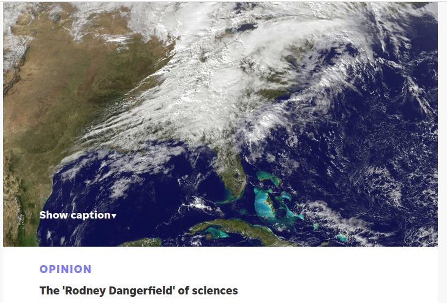

## »Der Frank Sinatra der Wettervorhersage«

### Cross-Lingual Vossian Antonomasia Extraction  

 

[Michel Schwab](https://hu.berlin/schwab/)¹, [Robert Jäschke](https://hu.berlin/RJ/)¹² and	[Frank Fischer](https://lehkost.github.io/)³
 

¹ Humboldt-Universität zu Berlin, 
² L3S Forschungszentrum Hannover,
³ Freie Universität Berlin 
  

<!--<ul>
<li class="web">[vossanto.weltliteratur.net](https://vossanto.weltliteratur.net/)
<li class="doc">Schwab, M., Jäschke, R., Fischer, F., Strötgen, J.: ['A Buster Keaton of Linguistics': First Automated Approaches for the Extraction of Vossian Antonomasia](https://doi.org/10.18653/v1/D19-1647). Proceedings of the 2019 Conference on Empirical Methods in Natural Language Processing. pp. 6239–6244. Association for Computational Linguistics, 2019.
</ul>-->

<b> ICNLSP 2022</b>

<!-- keep me, otherwise this gets interpreted as an ordered list -->

 17. December 2022 

  
This work is licensed under a <a rel="license" href="http://creativecommons.org/licenses/by/4.0/">Creative Commons Attribution 4.0 International License</a>.  
Data and Code are available at our <a href="https://vossanto.weltliteratur.net/">Website</a>.

 
<!-- .element: style="font-size:0.45em; margin-bottom: 0px; margin-top: 3em;" -->

---

## Inhalt

 

1. [Defintion and Examples](#/1)
2. [Motivation and Difficulty](#/2)
3. [Data and Methods](#/3)
4. [Evaluation and Analysis](#/4)

---

# Defintion and Examples

--

## Definition

 

<!--[portrait of Gerhard Johannes Vossius; source: Wikimedia Commons](images/vossius.jpg)
 .element width="100px" --> 

- a trope, closely related to metaphor and metonymy
- special case of general antonomasia
- attributing a particular property to an entity by naming another named entity, that is typically well-known for the respective property

<!-- .element width="450px" -->

<small>
image sources: <a href="https://commons.wikimedia.org/wiki">Wikimedia Commons</a></small>

--

## Examples

 

<!-- .element height="400px" --> 

 

= Jim Koch (Quelle: [theatlantic.com](https://www.theatlantic.com/magazine/archive/2014/11/the-steve-jobs-of-beer/380790/), 2014)

--

## Examples

 

<!-- .element width="400px" -->

 

= Tatsuo Horiuchi (Quelle: [theschedio.com](https://theschedio.com/painting-on-excel/), 2020)
 

--

## Examples

 

<!-- .element width="400px" -->

 

= Truffles (Quelle: [capeinsights.com](https://www.capeinsights.com/the-mozart-of-mushrooms/), 2021)

--

## Examples

 

<!-- .element width="400px" -->

 

= Modern Meteorology (Quelle: [delawareonline.com](https://eu.delawareonline.com/story/opinion/columnists/1/01/01/the-roger-dangerfield-of-sciences/3663375/))

---

# Difficulty and Motivation 

--

##  Difficulty - semantic understanding

 
 

&rarr; requires deep cultural background kowledge

<table>
    <thead>
        <tr>
            <th>VA Phrase </th>
            <th>Explanation</th>
        </tr>
    </thead>
    <tbody>
        <tr>
            <td>the Dolly Parton of cakes </td>
            <td>a little bit tacky, but you love her</td>
        </tr>
        <tr>
            <td>the Donald Trump of the horse show world </td>
            <td>buying and selling horses like so many pieces of real estate, pocketing a profit and never shedding a tear as she watches her property being trucked away</td>
        </tr>
    </tbody>
</table>

--

## Difficulty - syntactic ambiguity

 

<table>
    <thead>
        <tr>
            <th>VA phrase </th>
            <th>literal phrase </th>
        </tr>
    </thead>
    <tbody>
        <tr>
            <td>the Beethoven of traffic cops </td>
            <td>the Beethoven of the 5th Symphony </td>
        </tr>
        <tr>
            <td>the Nobel of maths </td>
            <td>the Nobel of physics</td>
        </tr>
        <tr>
            <td>the Chinese Barack Obama </td>
            <td>the American Barack Obama </td>
        </tr>
    </tbody>
</table>

--

## Motivation

 

- help to improve other NLP tasks, such as
    - fact extraction
    - entity disambiguation/co-reference resolution
- provide new interesting question answering tasks
- support creative natural language generation, especially in news and blog articles to generate fruitful content

---

# Data and Methods

 

 <!--
--

## Data

| Dataset | Language | Total  | VA    | no VA  | frac   |
|---------|----------|--------:|-------:|--------:|--------:|
| NYT-0   | English  | 5,995  | 3,066 | 2,929  | 0.51   |
| NYT-50  |  English | 55,995 | 3,066 | 52,929 | 0.05   |
| UMBL    |   German | 362    | 362   | -      | 100.00 |
| ZEIT    |   German | 224    | 224   | -      | 100.00 |
| NEG-1   |   German | 3,000  | -     | 3,000  | 0.00   |
| NEG-2   |   German | 3,000  | -     | 3,000  | 0.00   |
| NEG-3   |   German | 3,000  | -     | 3,000  | 0.00   |

-->

--

## Data

 

<table class="data">
<thead>
  <tr style="border-bottom:2px solid black">
    <th>Dataset</th>
    <th>Language</th>
    <th align='right'>Total </th>
    <th align='right'>VA</th>
    <th align='right'>no VA</th>
    <th align='right'>frac</th>
  </tr>
</thead>
<tbody>
  <tr>
    <td>NYT-0</td>
    <td>English</td>
    <td>5,995</td>
    <td>3,066</td>
    <td>2,929</td>
    <td>0.51</td>
  </tr>
  <tr style="border-bottom:2px solid black">
    <td>NYT-50</td>
    <td>English</td>
    <td>55,995</td>
    <td>3,066</td>
    <td>52,929</td>
    <td>0.05</td>
  </tr>
  <tr>
    <td>UMBL</td>
    <td>German</td>
    <td>362</td>
    <td>362</td>
    <td>-</td>
    <td>100.00</td>
  </tr>
  <tr>
    <td>ZEIT</td>
    <td>German</td>
    <td>224</td>
    <td>224</td>
    <td>-</td>
    <td>100.00</td>
  </tr>
  <tr>
    <td>NEG-1</td>
    <td>German</td>
    <td>3,000</td>
    <td>-</td>
    <td>3,000</td>
    <td>0.00</td>
  </tr>
  <tr>
    <td>NEG-2</td>
    <td>German</td>
    <td>3,000</td>
    <td>-</td>
    <td>3,000</td>
    <td>0.00</td>
  </tr>
  <tr>
    <td>NEG-3</td>
    <td>German</td>
    <td>3,000</td>
    <td>-</td>
    <td>3,000</td>
    <td>0.00</td>
  </tr>
</tbody>
</table>

 

- Annotation Process: IOB-Tagging
- NYT-0: semi-automated creation, English (Schwab et al. ([2019](https://doi.org/10.18653/v1/D19-1647), [2022](https://doi.org/10.3389/frai.2022.868249)))
- [UMBL](https://umblaetterer.de/datenzentrum/vossianische-antonomasien.html): manual creation, German
- ZEIT: semi-automated creation, German ([Jäschke et al. 2017](https://zenodo.org/record/4646126#.Y6AzIafMLJU))
- NEG-1/2/3: semi-automated creation, German (syntactically similar, semantically similar, random)

--

## Data - syntactic variations in German

 

<table>
    <thead>
        <tr>
            <th> NYT-0</th>
	     <th> UMBL, ZEIT</th>
        </tr>
    </thead>
    <tbody>
        <tr>
            <td>a/an/the SOURCE of/for/among  MODIFIER</td>
	    <td>ein/eine/der/die/das SOURCE der/des/für/von/... MODIFIER</td> 
        </tr>
        <tr>
            <td></td>
            <td>ein/eine/der/die/das MODIFIER  SOURCE</td>
        </tr>
        <tr>
            <td></td>
            <td>eine Art SOURCE der/des/für/von/... MODIFIER</td>
        </tr>
	<tr>
            <td></td>
            <td>a/an/the MODIFIER equivalent of  SOURCE </td>
        </tr>
    </tbody>
</table>

--

## Models I - Machine translation and alignment
 
 

<!-- .element height="500px" --> 

--

## Models II - Zero-Shot

 

- Zero-shot approaches on multilingual language models have recently shown great advances
- used for examples like ours: Few annotated data in target language
- no preprocessing
- Model: XLM-RoBERTa [Conneau et al., 2020](https://doi.org/10.18653/v1/2020.acl-main.747)

---

# Evaluation

--

## Results

 

<table class="eval">
  <caption style="caption-side:bottom">Evaluation on the test datasets (combined).</caption>
  <tr style="border-bottom:2px solid black">
    <th>model</th>
    <th>train</th>
    <th align="right">F1 (COMB)</th>
    <th align="right" style="width:15%">F1 (ROB)</th>
  </tr>
    <td rowspan="2">0shot</td>
    <td>NYT-0</td>
    <td align="right">0.777</td>
    <td></td>
  </tr>
  <tr>
    <td>NYT-50</td>
    <td align="right">0.503</td>
    <td></td>
  </tr>
  <tr>
    <td rowspan="2">de2en</td>
    <td>NYT-0</td>  
    <td align="right">0.688</td>
    <td></td>
  </tr>
  <tr>
    <td>NYT-50</td>
    <td align="right">0.678</td>
    <td></td>
  </tr>
  <tr>
    <td rowspan="2">en2de</td>
    <td>NYT-0</td>
    <td align="right">0.855</td>
    <td align="right">(0.695)</td>
  </tr>
  <tr>
    <td rowspan="2">NYT-50</td>
    <td align="right">0.851</td>
    <td align="right">(0.667)</td>
  </tr>
  <tr style="border-bottom:2px solid black"></tr>
</table>

--

## Results - Robustness study

 

- sample-based on unlabeled real-world data ([Schwab et al. 2022](https://doi.org/10.3389/frai.2022.868249))
- difficulty: highly imbalanced 

 
 

1. prediction mean score of a predicted sentence &rarr; <b>"confidence" of predicted tags for a sentence</b> 
    - $\sigma_s=\frac{1}{n}\sum^n_{i=1} \delta_{w_i}$
2. split data based on their predicted tags
    - SRC <b>and</b> MOD tag &rarr; VA prediction
3. choose samples based on mean score:
    - confident scores in both sets
    - unconfident scores in both sets

 <!-- .element height="100px" align="center" --> 

---

# Bibliography 

 

- Alexis Conneau, Kartikay Khandelwal, Naman Goyal,
Vishrav Chaudhary, Guillaume Wenzek, Francisco
Guzmán, Edouard Grave, Myle Ott, Luke Zettle-
moyer, and Veselin Stoyanov. 2020. Unsupervised
cross-lingual representation learning at scale. In Pro-
ceedings of the 58th Annual Meeting of the Asso-
ciation for Computational Linguistics, pages 8440–
8451, Online. Association for Computational Lin-
guistics.

- Jacob Devlin, Ming-Wei Chang, Kenton Lee, and
Kristina Toutanova. 2018. Bert: Pre-training of deep
bidirectional transformers for language understand-
ing. arXiv preprint arXiv:1810.04805.

- Masoud Jalili Sabet, Philipp Dufter, François Yvon,
and Hinrich Schütze. 2020. SimAlign: High qual-
ity word alignments without parallel training data
using static and contextualized embeddings. In Find-
ings of the Association for Computational Linguistics:
EMNLP 2020, pages 1627–1643, Online. Association
for Computational Linguistics.

- Robert Jäschke, Jannik Strötgen, Elena Krotova, and
Frank Fischer. 2017. “Der Helmut Kohl unter
den Brotaufstrichen”. Zur Extraktion Vossianischer
Antonomasien aus großen Zeitungskorpora. In Pro-
ceedings of the DHd 2017, DHd ’17, pages 120–124.
Digital Humanities im deutschsprachigen Raum.

- Myle Ott, Sergey Edunov, Alexei Baevski, Angela Fan,
Sam Gross, Nathan Ng, David Grangier, and Michael
Auli. 2019. fairseq: A fast, extensible toolkit for
sequence modeling. In Proceedings of the 2019 Con-
ference of the North American Chapter of the Associa-
tion for Computational Linguistics (Demonstrations),
pages 48–53, Minneapolis, Minnesota. Association
for Computational Linguistics.

- Michel Schwab, Robert Jäschke, Frank Fischer, and Jan-
nik Strötgen. 2019. “A Buster Keaton of Linguistics”:
First automated approaches for the extraction of vos-
sian antonomasia. In Proceedings of the 2019 Confer-
ence on Empirical Methods in Natural Language Pro-
cessing and the 9th International Joint Conference
on Natural Language Processing (EMNLP-IJCNLP),
pages 6238–6243, Hong Kong, China. Association
for Computational Linguistics.

- Michel Schwab, Robert Jäschke, and Frank Fischer.2022. ”The Rodney Dangerfield of Stylistic De-
vices”: End-to-end detection and extraction of Vos-
sian Antonomasia using neural networks. Frontiers
in Artificial Intelligence.

<!-- THIS IS AN EXAMPLE TO SPLIT SLIDE INTO TWO COLUMNS
--
## 

### Machine Translation and Alignment

### Zero-Shot

 -->

</script>