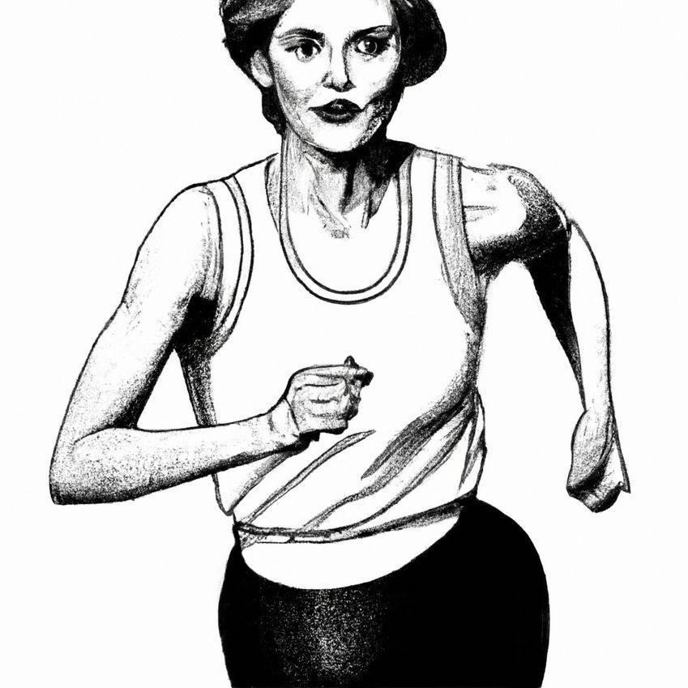
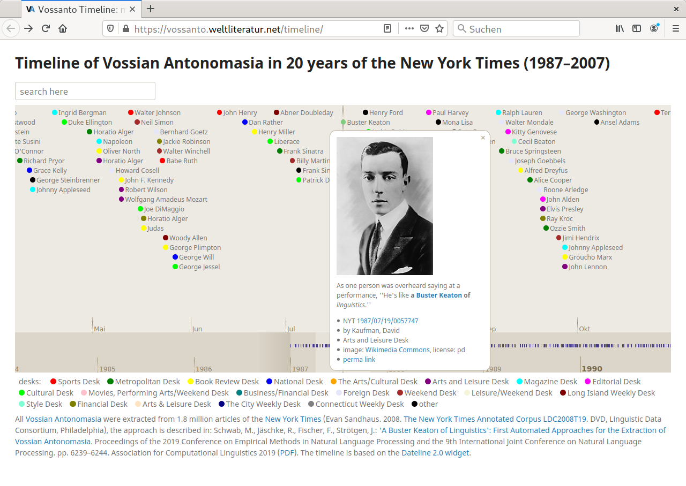
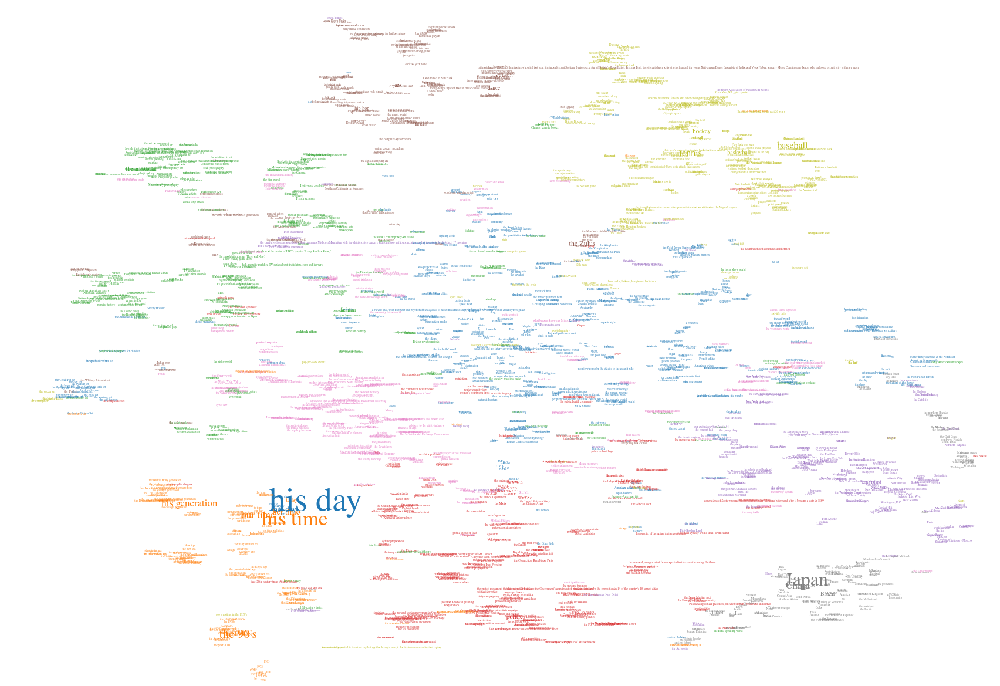
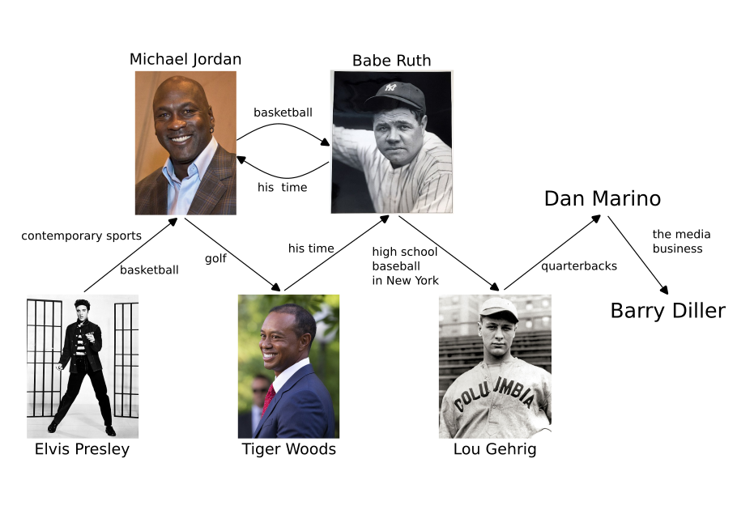

### »Who is the Madonna of Italian-American Literature?« - Extracting and Analyzing Target Entities of Vossian Antonomasia

<!-- <!-- .element height="200px;" --> 

Michel Schwab ¹  · Robert Jäschke ¹,³ <!-- .element: style="font-size:0.8em;" --> · Frank Fischer ² <!-- .element: style="font-size:0.8em;" -->

1 · Humboldt-Universität zu Berlin  
2 · Freie Universität Berlin<!-- .element: style="font-size:0.6em;" -->  
3 · L3S Research Center Hannover<!-- .element: style="font-size:0.6em;" -->

 URL of this presentation: <!-- .element: style="font-size:0.6em;" --> **[todo](todo)**  <!-- .element: style="font-size:0.6em;" -->

[SIGHUM2023](https://sighum.wordpress.com/events/latech-clfl-2023/) &nbsp;·&nbsp; Dubrovnik &nbsp;🇭🇷 &nbsp;·&nbsp; Fr, 05. Mai 2023
<!-- .element: style="font-size:0.8em;" -->

---

## Content

 

1. [Definition and Examples](#/1)
2. [Motivation and Difficulty](#/2) 
3. [Task](#/3)
4. [Data](#/4)
5. [Methods](#/5)
6. [Evaluation](#/6)
7. [Findings](#/7)
8. [Bibliography](#/8)

---

# Definition and Examples

--

## Vossian Antonomasia (Vossanto)

 

<!--[portrait of Gerhard Johannes Vossius; source: Wikimedia Commons](images/vossius.jpg)
 .element width="100px" --> 

- a trope, closely related to metaphor and metonymy
- special case of general antonomasia
- attributing a particular property to an entity by naming another named entity, that is typically well-known for the respective property
- first described around 1600 from Gerardus Vossius
- consists of Target, Source, Modifier (cf. Bergien 2013)

--

## »the Michael Jordan of football«

 

<!-- .element width="450px" -->

<small>
image sources: <a href="https://commons.wikimedia.org/wiki">Wikimedia Commons</a></small>

--

## Examples

 

<!-- .element height="400px" --> 

 

= Jim Koch (Quelle: [theatlantic.com](https://www.theatlantic.com/magazine/archive/2014/11/the-steve-jobs-of-beer/380790/), 2014)

---

# Task

--

## Vossanto Research

 

  

    

    <i class="icon fa fa-home"></i>
    

      <h2>DHd 2017</h2>
      

        Jäschke et al.
      

    

  

  

    

    <i class="icon fa fa-gift"></i>
    

      <h2>DSH 2019</h2>
      

       Fischer and Jäschke
      

    

  

  

    

    <i class="icon fa fa-user"></i>
    

      <h2>EMNLP-IJCNLP 2019</h2>
      

        Schwab et al.
      

    

  

  

    

    <i class="icon fa fa-running"></i>
    

      <h2>Frontiers in Artificial Intelligence 2022</h2>
      

      Schwab et al.
      

    

  

  

    

    <i class="icon fa fa-cog"></i>
    

      <h2>ICNLSP 2022</h2>
      

        Schwab et al.
      

    

  

  

    

    <i class="icon fa fa-certificate"></i>
    

      <h2>DHd 2023</h2>
      

      Schwab and Fischer
      

    

  

  

    

    <i class="icon fa fa-cog"></i>
    

      <h2>SIGHUM 2023</h2>
      

        Schwab et al.
      

    

  

--

## Interactive explorable data I

 

<!-- .element width="70%" -->

https://vossanto.weltliteratur.net/timeline/

--

## Interactive explorable data II

 

<!-- .element width="70%" -->

https://vossanto.weltliteratur.net/dhd2023/modifier.html

--

## Target Extraction and Linking

 

- *Previous approaches*: Vossanto detection and analysis on sentence level
- *Problem*: Target name not mentioned inside sentence
- *New in this paper*: **Extraction and linking of target entity**
- *Application*: Web-App for Exploration

---

# Data

--

## Vossanto Dataset (Schwab et al. (2019, 2022, 2023))

 

1. regular expression: <code>a/an/the [up to 10 words] of/for/among</code>
      &#8594; candidate sentences
2. Check with Wikidata list consisting of names and aliases having ›instance-of‹ property ›human‹
      &#8594; Focus on persons
3. Check with manual currated blacklist
      &#8594; <s>the House of Commons</s> (vgl. <a href="https://www.wikidata.org/wiki/Q3139666">Homer Doliver House</a>)

 <b>Result</b>: 6,095 sentences, <b>3,115</b> include Vossantos 

--

## Most frequent targets

 

| target             | count |
|--------------------|-------|
| Bill Clinton       |     8 |
| P. T. Barnum       |     6 |
| Michael Jordan     |     6 |
| Will Eno           |     6 |
| Tiger Woods        |     5 |
| John McEnroe       |     5 |
| Benjamin Netanyahu |     5 |
| James Prosek       |     5 |
| Frederick Ashton   |     5 |
| Oscar D'León       |     4 |

---

# Methods

--

## Baselines: Coreference Resolution

 

#### 1. Baseline: Reference chain VA phrase

''It is the Madonna of Italian-American literature in that it shows the transition from the Italian immigrant to American citizen like no other book of its genre.''

#### 2. Baseline: Reference chain that includes target reference

''It is the Madonna of Italian-American literature in that it shows the transition from the Italian immigrant to American citizen like no other book of its genre.''

  

#### Model: Toshniwal et al. 2021 - Longformer based

--

## Baselines - Process

 

 
[. . .]
 It forms the underpinnings for Ms. Barolini's epic saga ''Umbertina,'' [. . .] ''It is the Madonna of Italian-American literature in that it shows the transition from the Italian immigrant to American citizen like no other book of its genre.''
[. . .] 

&darr; Coreference resolution  &darr;
 
[Helen Barolini, Ms. Barolini, ...], [Umbertina, It, ...], ... 

&darr; Choose reference chain  &darr;
 
[Umbertina, It, the Madonna of Italian-American literature, it]

&darr; NER (Akbik et al. 2018) &darr;
 
[Umbertina [PER], It, the Madonna [PER] of Italian-American [MISC] literature, it]

&darr; Select first named entity &darr;
 
Umbertina

--

## Question-Answering

 

- Idea: Transform annotated VA phrase into QA task
    - the SOURCE of MODIFIER &rarr; Who is the SOURCE of MODIFIER?
- Independent of the syntax of VA phrases:
    - the German `(answer to|equivalent of|version of)?` Madonna  
    &rarr; Who is the German `(answer to|...)?`  Madonna?
- Context for extractive QA: article text
- usually the name of the target entity appears before the VA phrase 
&rarr; truncate context after VA phrase appears	

 

 

#### Model: Clark et al. 2020 - ELECTRA fine-tuned on SQUAD2.0

--

## Question-Answering - Process

 

[. . .] It forms the underpinnings for Ms. Barolini's epic saga ''Umbertina,'' [. . .] ''It is the Madonna of Italian-American literature in that it shows the transition from the Italian immigrant to American citizen like no other book of its genre.'' [. . .]

&darr; Transform into QA task &darr;
 

<code class="json">
{
Question: "Who is the Madonna of Italian-American literature?"
 
Context: [truncated] article_text
}
</code>

&darr; QA &darr; 
Umbertina

--

## Hybrid Approach: QA + COREF

 

- Pre-Analysis of QA output: courtesy title + last name instead of full name (e.g. Ms. Valdes instead of Zoe Valdes)

''They are always talking about the coarse Zoe Valdes, the crude Zoe Valdes,'' she explained. ''In that way, the Cuban state can discredit me here.'' .
 [. . .]
Alejandro Armengol, a critic for El Nuevo Herald, a Miami newspaper, dismissed  Ms. Valdes last year as ''the Madonna of Cuban literature, with an equal capacity to transform self-assurance and the grotesque into spectacle, to show vulgarity and eroticism stripped of any mystery.''

&rarr; Idea: Combine both approaches

--

## Hybrid Approach - Process

 

 
[. . .] ''They are always talking about the coarse Zoe Valdes, the crude Zoe Valdes,'' she explained. ''In that way, the Cuban state can discredit me here.''. [. . .] Alejandro Armengol, a critic for El Nuevo Herald, a Miami newspaper, dismissed Ms. Valdes last year as ''the Madonna of Cuban literature, with an equal capacity to transform self-assurance and the grotesque into spectacle, to show vulgarity and eroticism stripped of any mystery.'' [. . .] 

&darr; Question Answering &darr;
 
Ms. Valdes

&darr; Coreference resolution & Select reference chain  &darr;
 
[Zoe Valdes, Zoe Valdes, she, me, Ms. Valdes, the Madonna of Cuban literature]

&darr; NER (Akbik et al. 2018) &darr;
 
[Zoe Valdes [PER], Zoe Valdes [PER], she, me, Ms. Valdes [PER], the Madonna [PER] of Cuban [MISC] literature]

&darr; Select longest named entity that shares at least one word with QA output  &darr;
 
Zoe Valdes

--

## Entity Linking

 

- Baselines: EL on each reference in chain &rarr; majority vote

- Hybrid Approach: EL on each reference in chain &rarr; largest word overlap with the QA output

 
 

#### Model: Cao et al. 2020 - GENRE 

---

# Evaluation and Analysis

--

## Evaluation

 

<table style="text-align: center; margin-left: auto; margin-right: auto;">
  <thead>
    <tr>
    <th colspan="1" </th>
      <th colspan="4" style="text-align:center; border-bottom:2px solid black; border-right:0.6em solid #f4f4e7;">Extraction</th>
      <th colspan="1" style="text-align:center; border-bottom:2px solid black; border-left:0.8em solid #f4f4e7;">Linking</th>
    </tr>
    <tr style="border-bottom:2px solid black">
    <th>model</th>
      <th>prec</th>
      <th>rec</th>
      <th>f1</th>
      <th>em</th>
      <th style="text-align:right;">mp</th>
      </tr>
  </thead>
  <tbody>
    <tr>
      <td>LFp</td>
      <td style="text-align:right;">.29</td> 
      <td style="text-align:right;">.28</td>
      <td style="text-align:right;">.29</td>
      <td style="text-align:right;">.25</td>
      <td style="text-align:right;">.21</td>
    </tr>
    <tr style="border-bottom:1px solid black">
      <td>LFt</td>
      <td style="text-align:right;">.58</td>
      <td style="text-align:right;">.54</td>
      <td style="text-align:right;">.56</td>
      <td style="text-align:right;">.47</td>
      <td style="text-align:right;">.46</td>
    </tr>
    <tr>
      <td>ELEc</td>
      <td style="text-align:right;">.66</td>
      <td style="text-align:right;">.62</td>
      <td style="text-align:right;">.64</td>
      <td style="text-align:right;">.52</td>
      <td style="text-align:right;">.55</td>
    </tr>
    <tr>
      <td>ELEs</td>
      <td style="text-align:right;">.74</td>
      <td style="text-align:right;">.71</td>
      <td style="text-align:right;">.72</td>
      <td style="text-align:right;">.61</td>
      <td style="text-align:right;">.62</td>
    </tr>
     <tr style="border-bottom:2px solid black">
      <td>ELEs+LF</td>
      <td style="text-align:right; font-weight:bold;">.78</td>
      <td style="text-align:right; font-weight:bold;">.77</td>
      <td style="text-align:right; font-weight:bold;">.78</td>
      <td style="text-align:right; font-weight:bold;">.71</td>
      <td style="text-align:right; font-weight:bold;">.64</td>
    </tr>
  </tbody>
</table>

---

## Findings

 

[Interactive web demo](https://vossanto.weltliteratur.net/sighum2023/graph.html)

<!-- .element width="700px" -->

--

### Thank you!

 

[vossanto.weltliteratur.net](https://vossanto.weltliteratur.net/)

 

<!-- <small>Paper:  doi:[10.5281/zenodo.7715490](https://doi.org/10.5281/zenodo.7715490)</small> -->
 

---

## Bibliography

 

- Akbik, Alan ; Blythe, Duncan ; Vollgraf, Roland ; Bender, Emily M. (Bearb.) ; Derczynski, Leon (Bearb.) ; Isabelle, Pierre (Bearb.): Contextual String Embeddings for Sequence Labeling.. In: COLING : Association for Computational Linguistics, 2018. - ISBN 978-1-948087-50-6, S. 1638-1649 
- Bergien, Angelika: Names as frames in current-day media discourse. In: Proceedings of the second international conference on onomastics. Cluj-Napoca : Editura Mega, 2013, S. 19-27.
- Cao, Nicola De ; Izacard, Gautier ; Riedel, Sebastian ; Petroni, Fabio: Autoregressive Entity Retrieval.. In: CoRR, abs/2010.00904 (2020)
- Clark, Kevin ; Luong, Minh-Thang ; Le, Quoc V. ; Manning, Christopher D.: ELECTRA: Pre-training Text Encoders as Discriminators Rather Than Generators. In: International Conference on Learning Representations, 2020 
- Schwab, Michel ; Jäschke, Robert ; Fischer, Frank ; Strötgen, Jannik: »A Buster Keaton of Linguistics« – First Automated Approaches for the Extraction of Vossian Antonomasia. In: Proceedings of the 2019 Conference on Empirical Methods in Natural Language Processing and the 9th International Joint Conference on Natural Language Processing : Association for Computational Linguistics, 2019 (EMNLP '19), S. 6239--6244.
- Schwab, Michel ; Jäschke, Robert ; Fischer, Frank: »The Rodney Dangerfield of Stylistic Devices« – End-to-End Detection and Extraction of Vossian Antonomasia Using Neural Networks. In: Frontiers in Artificial Intelligence , 5 (2022).
- Toshniwal, Shubham ; Xia, Patrick ; Wiseman, Sam ; Livescu, Karen ; Gimpel, Kevin: On Generalization in Coreference Resolution. In: Proceedings of the Fourth Workshop on Computational Models of Reference, Anaphora and Coreference. Punta Cana, Dominican Republic : Association for Computational Linguistics, 2021, S. 111--120

