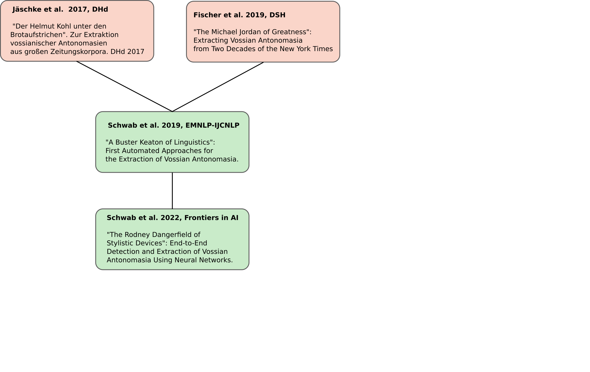

### Automatic Detection, Extraction and Analysis of the stylistic device Vossian Antonomasia

Michel Schwab  

Humboldt-Universität zu Berlin  

 URL of this presentation: <!-- .element: style="font-size:0.6em;" --> **[bit.ly/3UvC1JX](https://bit.ly/3UvC1JX)**  

IBI PhD Colloquium &nbsp;·&nbsp; Berlin &nbsp; 🇩🇪 &nbsp;·&nbsp; Fri, 30 June 2023
<!-- .element: style="font-size:0.8em;" -->

---

## Content

 

1. [PhD Progress](#/1)
2. [VA Definition and Examples](#/2)
3. [Motivation](#/3)
4. [Chapters](#/4)
5. [Findings](#/5)

---

## PhD Progress

 

<!-- .element width="80%" -->

---

# Definition and Examples

--

## Vossian Antonomasia (Vossanto)

 

<!--[portrait of Gerhard Johannes Vossius; source: Wikimedia Commons](images/vossius.jpg)
 .element width="100px" --> 

- a trope, closely related to metaphor and metonymy
- special case of general antonomasia
- attributing a particular property to an entity by naming another named entity, that is typically well-known for the respective property
- first described around 1600 by Gerardus Vossius
- consists of Target, Source, Modifier (cf. Bergien 2013)

--

## »the Michael Jordan of football«

 

<!-- .element width="450px" -->

<small>
image sources: <a href="https://commons.wikimedia.org/wiki">Wikimedia Commons</a></small>

--

## Examples

 

<!-- .element height="400px" --> 

 

= Jim Koch (Source: [theatlantic.com](https://www.theatlantic.com/magazine/archive/2014/11/the-steve-jobs-of-beer/380790/), 2014)

---

## Motivation

 

- Challenging task because of syntactic ambiguity:
    - the Michelangelo of the Sistine Chapel vs. the Michelangelo of Manhattan
    - the George W. Bush of 2016
- supports various NLP tasks like Coreference Resolution
- creates interesting new dataset for robustness studies, e.g. in Question-Answering
- support creative natural language generation
- the association of properties and characteristics to entities

---

## Chapters

--

### "A Buster Keaton of Linguistics": First Automated Approaches for the Extraction of Vossian Antonomasia.

 

<!-- .element width="80%" -->

--

### "A Buster Keaton of Linguistics": First Automated Approaches for the Extraction of Vossian Antonomasia.

 

- Datset creation (based on 20years NYT articles, ~1.8mio):
  1. Regex: a/an/the [up to 5 words] for/of/among
  2. Wikidata "human" list (labels + aliases)
  3. manual curated blacklist
  4. manual annotations vs. crowd sourcing

    &rarr; Labeled Dataset: 6,072 sentence of which 3,023 include VA expressions)
- Methods (automated):
   - Introduction of "popularity measure"
   - Alternative to Wikidata: NER tagger
   - Neural Network (Bidirectional Long-Short Term Memory) + Linear layer (binary classification)

--

### "The Rodney Dangerfield of Stylistic Devices": End-to-End Detection and Extraction of Vossian Antonomasia Using Neural Networks.

 

<!-- .element width="80%" -->

--

### "The Rodney Dangerfield of Stylistic Devices": End-to-End Detection and Extraction of Vossian Antonomasia Using Neural Networks.

 

- Annotate labeled Dataset on word-level (IOB tagging)

- Binary classification
   - BLSTM combined with Attention Layer
   - fine-tuned BERT (LLM)

-  Sequence Tagging
   - BLSTM-CRF
   - fine-tuned BERT

- Robustness Studies
    - sample-based approaches on unseen data

--

### "Der Frank Sinatra der Wettervorhersage": Cross-Lingual Vossian Antonomasia Extraction. 

 

<!-- .element width="80%" -->

--

### "Der Frank Sinatra der Wettervorhersage": Cross-Lingual Vossian Antonomasia Extraction. 

 

- (German) Dataset creation:
   - manual collected VA list
   - semi-automated approach from Jäschke et al. 2017
   - generation of negative test data
- Methods:
    - Zero-Shot Cross Lingual Transfer Learning: XLM-RoBERTa
    - Machine Translation and Alignment of Test Data: mBERT
    - Machine Translation and Alignment of Training Data: "german BERT"

--

### »Die Greta Garbo der Leichtathletik« - Eine systematische Analyse der Modifier vossianischer Antonomasien mithilfe von Word Embeddings. 

 

<!-- .element width="80%" -->

--

### »Die Greta Garbo der Leichtathletik« - Eine systematische Analyse der Modifier vossianischer Antonomasien mithilfe von Word Embeddings.

 

- Methods:
   1. Sentence-BERT (efficient Computing of semantic similarity)
   2. Clustering (k-means)
   3. Topic assignment for clusters (WordNet Domains)
   4. [interactive Visualization (Reduction algorithms (PCA, t-SNE, etc.))](https://vossanto.weltliteratur.net/dhd2023/modifier.html)

--

### »Who is the Madonna of Italian-American Literature?« - Extracting and Analyzing Target Entities of Vossian Antonomasia

 

<!-- .element width="80%" -->

--

### »Who is the Madonna of Italian-American Literature?« - Extracting and Analyzing Target Entities of Vossian Antonomasia

 

- Dataset creation:
   - Annotating target entity in corresponding article
- Methods:
    - Coreference Resolution (reference chain)
    - Question-Answering (transforming VA into Question)
    - Hybrid model (Coref + QA)

- [interactive visualization](https://vossanto.weltliteratur.net/sighum2023/graph.html)

--

### EMNLP 2023

 

<!-- .element width="80%" -->

--

### EMNLP 2023

 

- Dataset:
   - Data augmentation: the MJ of Germany
   
   &rarr; [the German|Germany's] [answer to|version of| equivalent of] MJ

- Focus on Generalizability
    - adapt linguistic metaphor theories (MIP, SPV) 
    - model as sentence pair (source, sentence)
    - introduce special characters
  

---

## Findings
   

- create annotated VA dataset
- first fully automated approaches to detect VA
- binary classification and sequence tagging
- robustness studies against unseen data
- cross-lingual VA detection
- target detection
- systematic analysis of the modifier
- data augmentation to create a diverse dataset
- methods for unseen syntactic varations
