## Detection, Extraction and Analysis of Vossian Antonomasia in Large Text Corpora Using Machine Learning

Michel Schwab  

Humboldt-Universität zu Berlin  

  

Probevortrag Promotion &nbsp;·&nbsp; Berlin &nbsp; 🇩🇪 &nbsp;·&nbsp; Di, 19.12.2023
<!-- .element: style="font-size:0.8em;" -->

---

## Inhalt

 

1. [Definition und Task](#/2)
2. [Motivation und Herausforderungen](#/3)
3. [Methoden und Ergebnisse](#/4)
4. [Zusammenfassung und Haupterkenntnisse](#/6)

---

## Definition und Task

--

## Vossianische Antonomasie (Vossanto)

 

- eine Trope, eng verwandt mit Metapher und Metonymie
- Ein Spezialfall oder Gegenstück zur klassischen Antonomasie, z.b. "Big Apple" für NYC
- zuerst explizit beschrieben ca. 1600 von Gerardus Vossius
- Zuweisung von bestimmten Eigenschaften an eine Entität durch Nennung einer anderen benannten Entität, die typischerweise für die betreffenden Eigenschaften bekannt ist
- besteht typischerweise aus **Target**, **Source** und **Modifier** (cf. Bergien 2013)

--

## »the Michael Jordan of football«

 

<!-- .element width="450px" -->

<small>
image sources: <a href="https://commons.wikimedia.org/wiki">Wikimedia Commons</a></small>

--

## Beispiel

 

<!-- .element height="400px" --> 

 

= Jim Koch (Source: [theatlantic.com](https://www.theatlantic.com/magazine/archive/2014/11/the-steve-jobs-of-beer/380790/), 2014)

--

<h2>Task</h2>

 

<h3>Erkennung</h3>

Identifikation von Sätzen, die eine VA enthält.

 

<h3>Extraktion</h3>

Identifikation der drei Komponenten.

 

<h3>Analyse</h3>

Tieferes Verständnis mit Hilfe explorativer Methoden.

<!-- Bilder in rechte Spalte, zum dazugehörigen Task -->

---

## Herausforderungen und Motivation

 

--

<h2>Herausforderungen zum Verständnis von VA</h2>

 

* Kulturelles und historisches Wissen (the Babe Ruth of golf)
* Zeitliche Veränderungen (the Donald Trump of ...)
* Kontext (Arnold Schwarzenegger of our times)

<!-- <h3> Kulturelles und historisches Wissen</h3>

the Lionel Messi of golf (Europe) ---- the Babe Ruth of golf (America)

 

<h3>Zeitliche Veränderungen</h3>

 Donald Trump of the horse show world (1992, Geschäftsmann) ----- Donald Trump of the Tropics (2019, Populist)

 

<h3>Kontext</h3>

Arnold Schwarzenegger of our time (Bodybuilder, Schauspieler, Politiker, American Dream)

-->

--

<h2>Herausforderungen bei der automatischen Identifikation von VA</h2>

 

* Semantische Mehrdeutigkeit (the Obama of 2020)
* Syntaktische Vielfalt
* Datenknappheit

<!--
<h3>Semantische Mehrdeutigkeit</h3>

<ul><li>the ENTITY of PHRASE (the Madonna of [Port Lligat|Japan], the Obama of 2020).</li>
</ul>

 

<h3>Syntaktische Vielfalt</h3>

<ul>
<li> [the/a/an] SOURCE [of/for/among] MODIFIER </li>
<li> [[the/a/an] MODIFIER/MODIFIER's] [ /answer to/equivalent of/version of] SOURCE</li></ul>

 

<h3>Daten</h3>

<ul><li>keine annotierten Datensätze </li>
<li> Trainingsdaten werden für ML Modelle benötigt </li>
<li> Bewertung von Modellen schwierig (insb. recall)</li></ul>

-->		

--

## Motivation

 

<h3>Forschungslücke</h3>

Vergleichsweise wenig erforscht gegenüber anderen rhetorischen Mitteln wie Metapher und Metonymie.

 

<h3>Geisteswissenschaften</h3>

Interdisziplinarität in Geisteswissenschaften: Linguistische, kognitive, kulturelle und historische Elemente. 

 

<h3>Natural Language Processing</h3>

<ul>
<li> Entwicklung neuer Datensätze zur Evaluierung verschiedener NLP Tasks (QA)</li>
<li>Coreference Resolution: Referenz von VA phrase zum Target</li> 
<li>Geografische Analyse: the Paris of the East</li> <!-- geographical parsing -->
<li>Sentimentanalyse: Verständnis von Stimmungen</li> <!--für Sätze, aber auch für genutzte Entitäten -->
<li>Kreative Sprachgenerierung: Texten "aufpeppen"</li>
</ul>

--

## Ziel der Disseration

 

- <strong>Forschungslücke schließen</strong>: Automatisierte Identifikation von VA. 
- <strong>Grundlage für weiterführende Forschung</strong>: Ermöglichung umfassenderer Analysen des Phänomens in größeren Maßstäben.

---

## Übersicht 

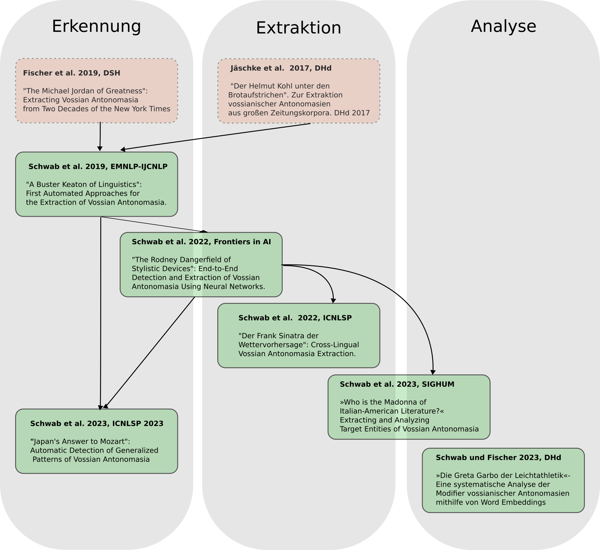<!-- .element width="60%" -->

---

### "A Buster Keaton of Linguistics": First Automated Approaches for the Extraction of Vossian Antonomasia.

 

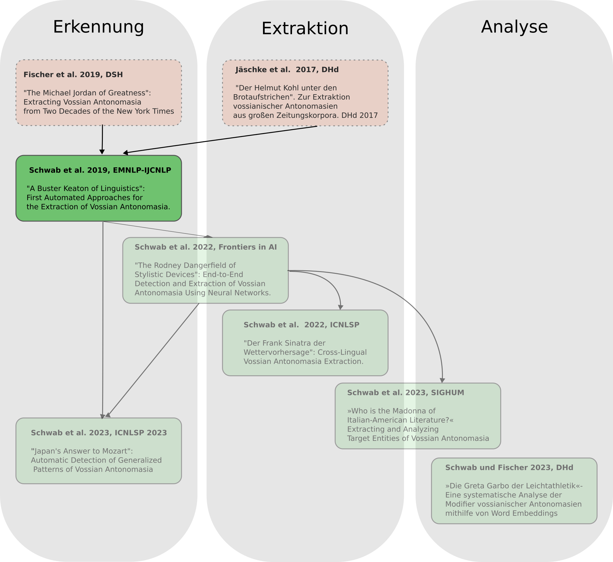<!-- .element width="60%" -->

--

## Methoden

 

<section>
    

        

<h3>Semi-Auto</h3>
            
<ol>
<li>NYT Corpus (~60Mio Sätze)</li>
<li>Regex: a/an/the [up to 5 words] for/of/among</li>
	    <li>Wikidata "human" Liste </li>
	    <li>Streichliste</li>
	    </ol>

<b>Datensatz</b>: Labeln der Daten (6,072; 3,023 VA)

        

        

<h3>Wikidata</h3>
            
<ul><li>Ersetzt Schritt 4 durch neues Maß: # WD Sitelinks </li>
	    <li>House (Botaniker) vs. House (Gebäude)</li>

</ul>

        
        

        

<h3>NER</h3>
            
Ersetzt Schritt 3 und 4 durch NER Tagger (spaCy)

        

        

<h3>BLSTM</h3>
            
<ul><li>Nutzung des gelabelten Datensatzes</li>
	    <li>GloVe + bidirectional LSTM + Linearer Layer</li>
	    <li>binäre Klassifikation</li></ul>

        
        

    

        

        

F1: 0.78
        
        

        

F1: 0.76

        

        

<b>F1: 0.86</b>
        
        

    

</section>

---

### "The Rodney Dangerfield of Stylistic Devices": End-to-End Detection and Extraction of Vossian Antonomasia Using Neural Networks.

 

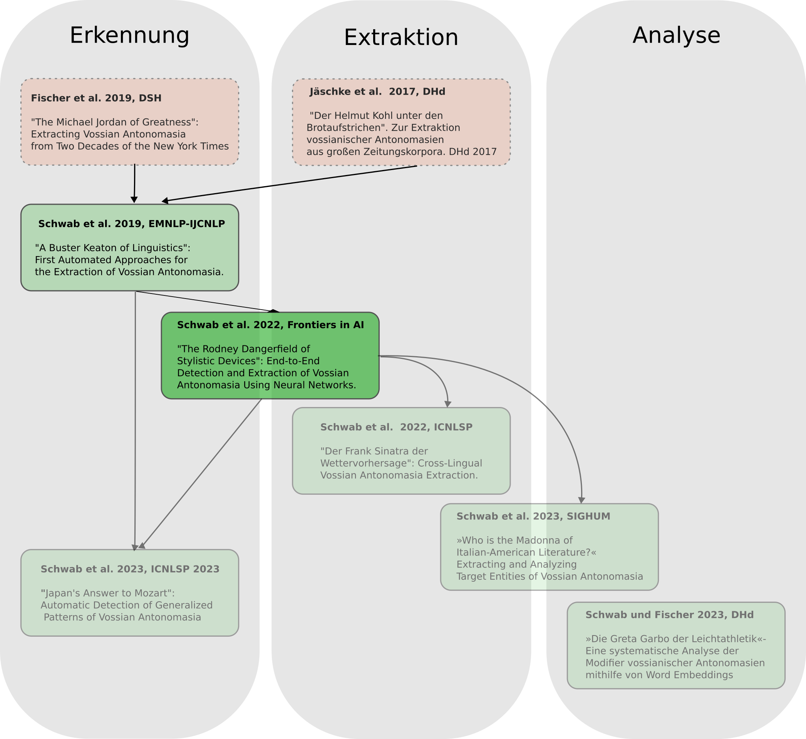<!-- .element width="60%" -->

--

### Methoden - Erkennung

 

    
    

    

     

Overview: BLSTM-ATT     

     

Overview: BERT (Classification) 

--

### Methoden - Extraktion

 

    
    

    

     

Overview: BLSTM-CRF     

     

Overview: BERT (Sequence Tagging)  

--

## Evaluation

 

<!-- .element width="80%" -->

--

<!-- ## Evaluation - aVA

 

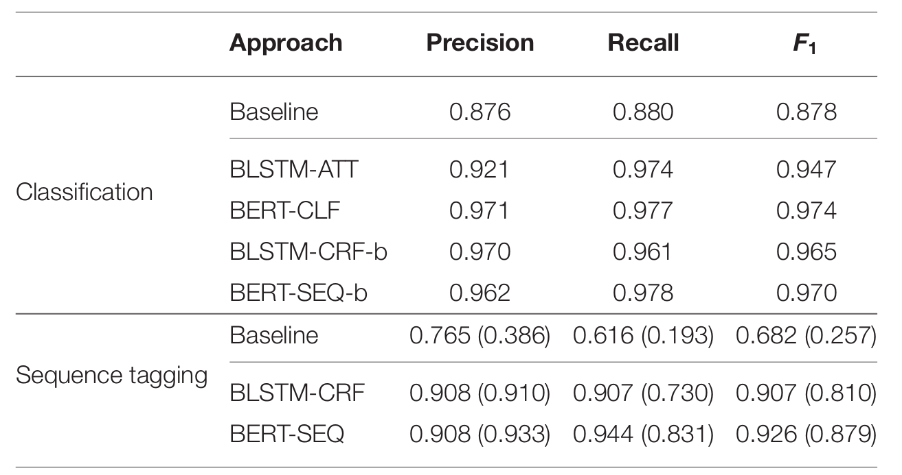<!-- .element width="80%" -->

<!--
## Evaluation - eVA

 

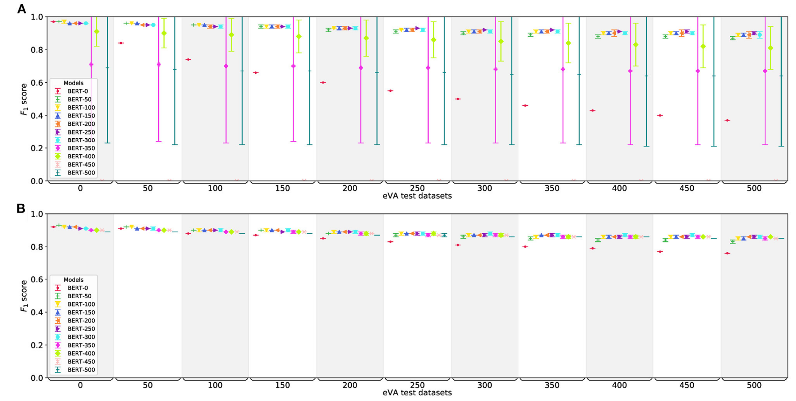<!-- .element width="80%" -->

## Evaluation - Robustheit

Datensatz: Signal Media Dataset

 

<h3>Klassifikation (A): BERT-CLF</h3>

<ul><li> Normalisierter Vorhersagewert</li></ul>

 

<h3>Sequence Tagging (B): BERT-SEQ</h3>

<ul><li> Vorhersagemarge: $\delta_w  = |P (t'\|\ w)-P(t'' \|\ w)|$</li>
<li> Vorhersagewert: $\mu_s = \frac{1}{n} \sum_{i=1}^{n}  \delta_{w_i}$</li></ul>

<!-- .element width="80%" -->

--

<!--## Results - Robustheit: Ergebnisse

 

Datensatz: Signal Media Dataset

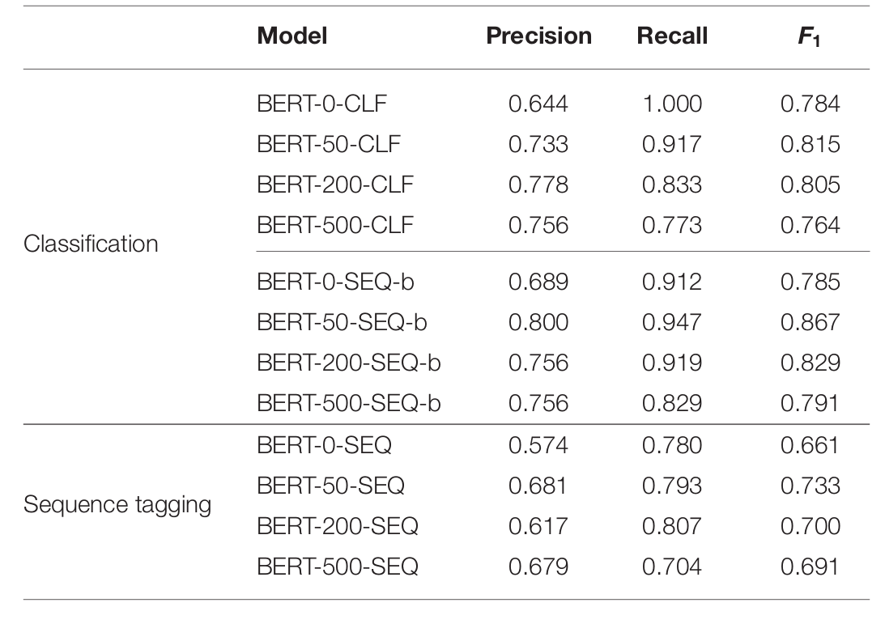<!-- .element width="80%" -->

## Evaluation - Generalization

 

Datensatz: NYT Corpus

Modell: BERT-SEQ

1. Extraktion neuer Entitätstypen von Sourceentitäten
2. Extraktion neuer syntaktischer Variationen

<!-- .element width="70%" -->

<!--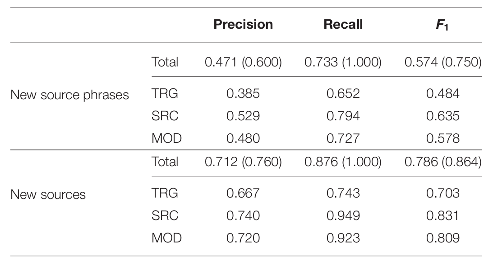<!-- .element width="50%" -->

---

### "Der Frank Sinatra der Wettervorhersage": Cross-Lingual Vossian Antonomasia Extraction. 

 

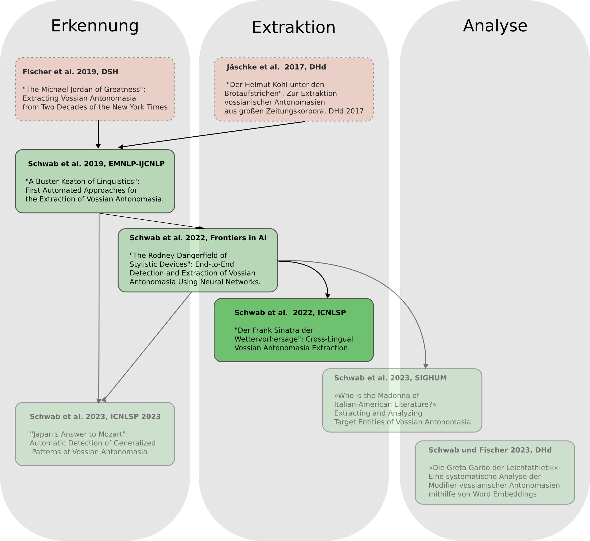<!-- .element width="60%" -->

--

### Daten	

<section>
    

        

            <h3>Training</h3>
            

Annotierte Daten aus Schwab et al. 2022
	    

        

       

<h3>Test: UMBL</h3>
<a href="https://umblaetterer.de/datenzentrum/vossianische-antonomasien.html">manuell gesammelte Liste von Frank Fischer</a>
        
        

       

<h3>Test: ZEIT</h3>
Daten von Jäschke et al. 2017: regelbasierter Ansatz
        
        

       

<h3>Test: negativ</h3>
   
<ol><li>Syntaktisch ähnliche Phrasen (Wiki)</li>
	    <li>Eigennamen aus Trainingsdaten (taz)</li>
   	    <li>zufällige Sätze (taz)</li>
</ol>

        
        

	

    

        

6,072 (3,023 VA Sätze)

        

       

362 VA Sätze
        
        

       

224 VA Sätze
        
        

       

3,000 Sätze pro Sample
        
        

	

</section>

--

### Methoden und Ergebnisse

<section>
    

        

            <h3>0shot</h3>
            
<ul>
	    <li>multilinguales Modell </li>
	    <li>XLM-RoBERTa (Conneau et al., 2020)</li>
	    </ul>
	    

       

<h3>de2en</h3>
   
<ul><li>Übersetzen der Testdaten FAIRSEQ (Ott et al., 2019)</li>
	    <li>Tagausrichtung: SimAlign (Jalili Sabet et al., 2020)</li>
	    <li>mBERT (Devlin et al., 2018)</li>
</ul>

        

       

<h3>en2de</h3>
   
<ul><li>Übersetzen der Trainingsdaten FAIRSEQ</li>
	    <li> Tagausrichtung SimAlign</li>
	    <li>DBMDZ BERT</li>
</ul>

        

     	

</section>

&rarr; en2de funktioniert am besten (F1: 0.86)

&rarr; Robustness study mit taz Artikeln (F1: 0.70)

---

### "Japan's Answer to Mozart": Automatic Detection of Generalized Patterns of Vossian Antonomasia

 

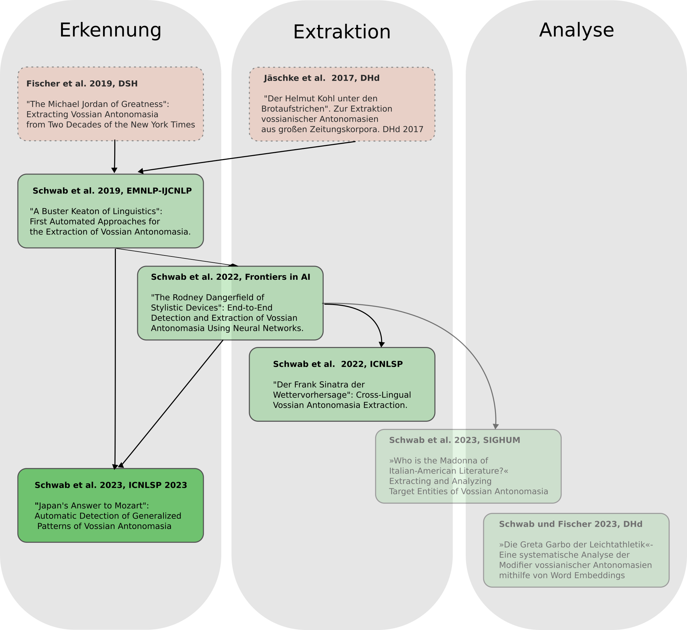<!-- .element width="60%" -->

--

## Daten

NER für Kandidatengenerierung
 

<section>

<h3>Trainingsdaten</h3>
            
<ul>
	    <li>Annotierte Daten aus Schwab et al. 2022</li>
	    </ul>
	    

       

<h3>Testdaten</h3>
   
<ul><li>Data augmentation</li>
	    <li> the SOURCE of MODIFIER</li>
	    <li> [the MOD_adj|MOD_noun's] [answer to| version of| equivalent of]? SOURCE</li>
	    <li>244 VA in Datensatz</li>
</ul>

        
        

    

        

<b>&rarr; 16,877 Tupel (2,868 positiv)</b>

        

        

<b>&rarr; 8,480 Tupel (2,196 positiv)</b>

        
        

    

</section>

--

## Methoden

 

<section>
    

        

<h3>BERT-SEQ</h3>
            

	    Adaption aus Schwab et al. 2022

        

<h3>BERT-MASK</h3>
   
<ul><li>Metonymie-Theorie: Kontext ist wichtiger als Wort selbst</li>
   <li>Adaption von Li et al., 2020</li>
</ul>

        

            <h3>RoBERTa-MIP</h3>
            
<ul><li>Metapher-Theorie: wörtliche und kontextuelle Bedeutung eines Wortes sind unterschiedlich</li>
	    <li>Adaption von Choi et al. 2022</li>
</ul>

        

        

            <h3>RoBERTa-SPV</h3>
	    
<ul><li>Metapher-Theorie: Wort erscheint in "ungewöhnlichen" Kontext</li>
	    <li>Adaption von Choi et al. 2022</li>
</ul>

    

        

<h3>RoBERTa-CLF</h3>
   
Einführung spezieller Tokens: [START_SRC], [END_SRC]

        

        

<h3>RoBERTa-PAIR</h3>
   
Satzpaare: [Source, Satz]

</section>

--

## Evaluation - Trainingsdatensatz

 

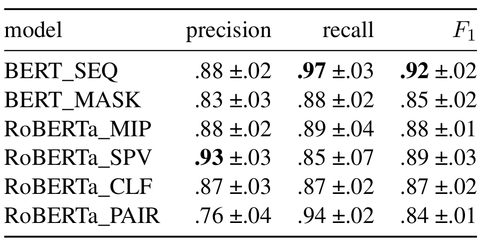<!-- .element width="80%" -->

--

## Evaluation - Testdatensatz

 

<!-- .element width="80%" -->

--

## Evaluation - POS und Syntax

 

<!-- .element width="80%" -->

---

### »Who is the Madonna of Italian-American Literature?« - Extracting and Analyzing Target Entities of Vossian Antonomasia

 

<!-- .element width="60%" -->

--

### Methoden und Ergebnisse

Datensatz: annotierter Datensatz aus Schwab et al., 2022.

<section>
    

        

<h3>COREF</h3>
            
<ul>
	    <li>Coreference Resolution</li>
	    <li>Longformer (Toshniwal et al. (2021))</li>
	    </ul>
	    

       

<h3>QA</h3>
   
<ul><li>Question-Answering</li>
   	    <li>ELECTRA (Clark et al. 2020), SQUAD2.0</li>
	    <li>Umformulierung: Who is the SOURCE of MODIFIER?</li>
</ul>

        

       

<h3>Hybrid</h3>
   
<ul><li>QA + COREF</li>
</ul>

        

     	

    

        

<ul><li>F1: 0.29 (0.56)</li>
<li>EM: 0.25 (0.47)</li></ul>

        

       

<ul><li>F1: 0.64 (0.72)</li>
<li>EM: 0.52 (0.61)</li></ul>

        

        

       

<ul><li><b>F1: 0.78</b></li>
<li><b>EM: 0.71</b></li></ul>

        

        

     	

 

        

<h3>Entity Linking</h3>

 

        

MP: 0.21 (0.46)

     	

       

MP: 0.55 (0.62)

     	

        

       

<b>MP:0.64</b>

        

     	

     	

</section>

--

## Analyse

 

[Interactive Visualization](https://vossanto.weltliteratur.net/sighum2023/graph.html)

---

### »Die Greta Garbo der Leichtathletik« - Eine systematische Analyse der Modifier vossianischer Antonomasien mithilfe von Word Embeddings.

 

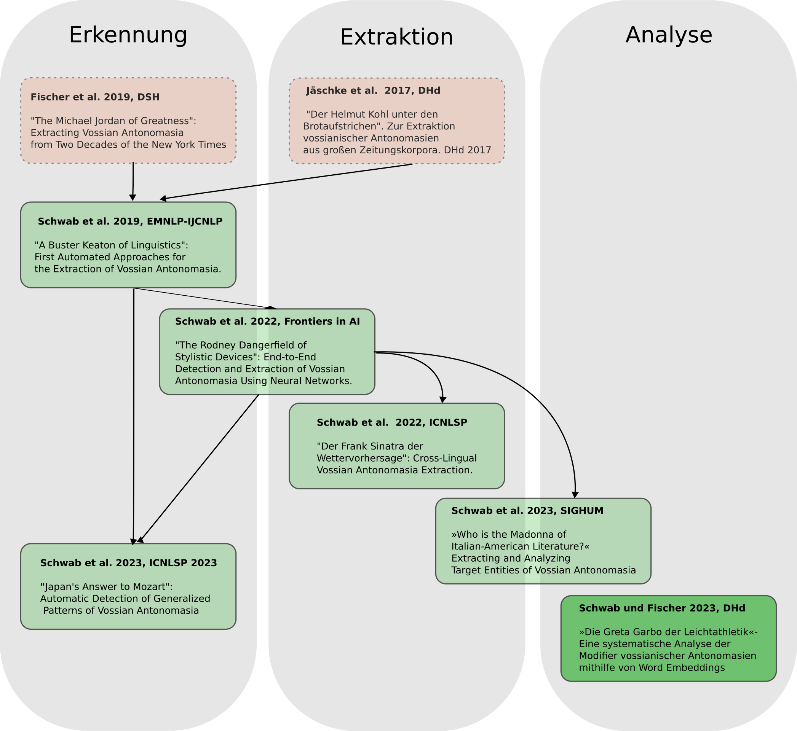<!-- .element width="60%" -->

--

### Vorgehen:

 

<section>

 

        

<h3>Repräsentation: Sentence-BERT</h3>

 

        

<h3>Clustering: k-means</h3>

 

        

<h3>lexikalische Themenmodellierung: WordNet Domains</h3>

 

        

<h3>Dimensionsreduktion: PCA, t-SNE, IVIS, UMAP</h3>

        

<h3><a href="https://vossanto.weltliteratur.net/dhd2023/modifier.html">Interaktive Visualisierung</a></h3>

</section>

---

## Zusammenfassung und Haupterkenntnisse

  

### Erkennung

<ol><li> Regelbasierte Ansätze &rarr; annotierter Datensatz</li>
<li> Robuste Methoden zur Erkennung von VA</li>
<li> Ausweitung auf neue syntaktische Variationen</li></ol>

 

### Extraktion

<ol><li> Modellierung als Sequence Tagging Task</li>
<li> Robuste Methoden zur Extraktion aller Komponenten</li>
<li> Sprachübergreifende Modelle</li>
<li> Extraktion des Targets im Artikel</li></ol>

 

### Analyse

<ol><li> Verbessertes Verständnis von VA durch annotierte Daten</li>
<li> Explorative Analyse von Source-Target Verbindungen</li>
<li> Systematische Analyse des Modifiers</li></ol>

