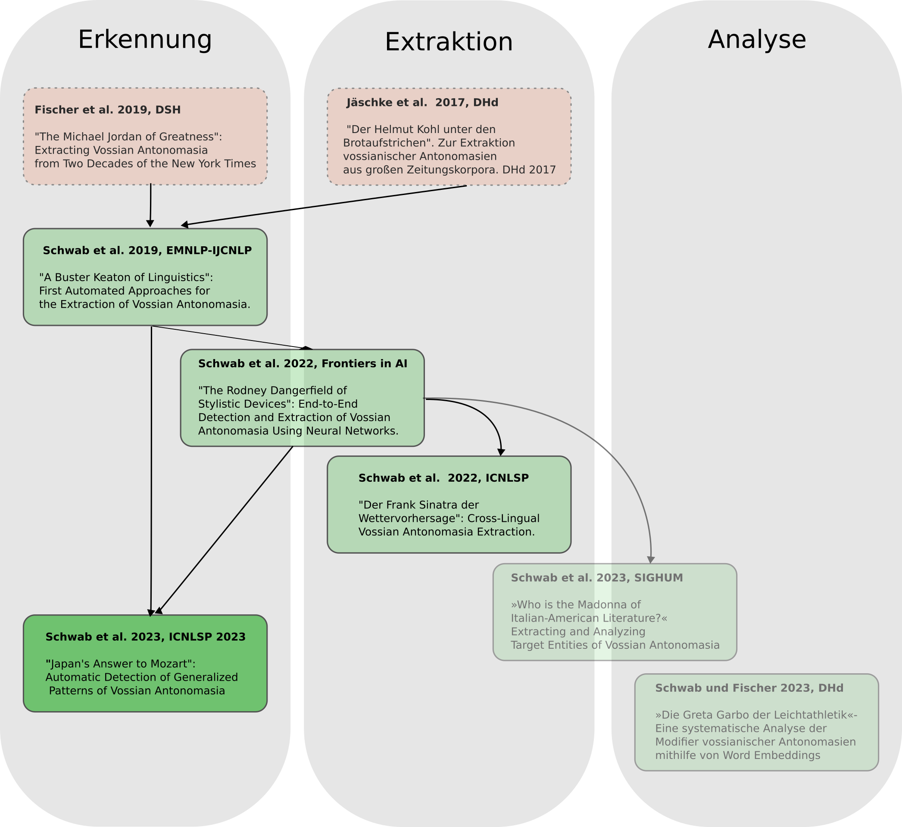
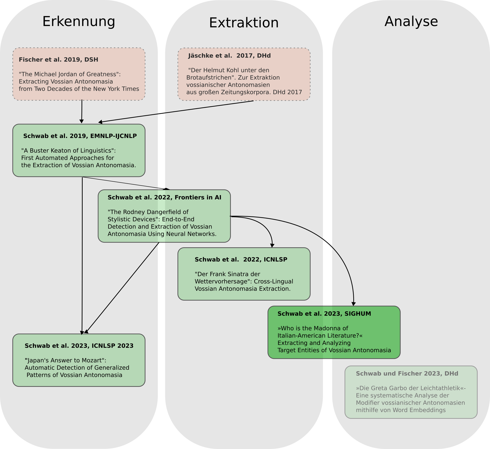

<section></section>

--

## Methoden

 

---

## Data

 

<section>
    

        

            <h3>Trainingsdaten</h3>
            
<ul>
	    <li>Annotierte Daten aus Schwab et al. 2022</li>
	    </ul>
	    

       

<h3>Testdaten</h3>
   
<ul><li>Data augmentation: Erzeugung neuer syntaktischer Variationen, die ihre Semantik beibhalten</li>
	    <li> the SOURCE of MODIFIER</li>
	    <li> &rarr; [the MOD_adj|MOD_noun's] [answer to| version of| equivalent of]? SOURCE</li>
    	    <li>Funktioniert nur mit geographischen Orten (WP Listen)</li>
	    <li>244 VA in Datensatz</li>
</ul>

        

    

        

<b>&rarr; 16,877 Tupel (2,868 positiv)</b>

        

	   
<b>&rarr; 8,480 Tupel (2,196 positiv)</b>

        

    

</section>

--

## Methods

 

<section>
    

        

            <h3>BERT-SEQ</h3>
            
<ul>
	    <li>Adaption aus Schwab et al. 2022</li>
	    <li>Fokus: Nur source tagging</li>
	    </ul>

        

<h3>BERT-MASK</h3>
   
<ul><li>Metonymie-Theorie: Kontext ist wichtiger als Wort selbst</li>
	    <li>Adaption von auf source</li>
	    <li>RoBERTa</li>
    	    <li></li>
</ul>

        

            <h3>RoBERTa-MIP</h3>
            
<ul><li>Metapher-Theorie: wörtliche und kontextuelle Bedeutung eines Wortes sind unterschiedlich</li>
	    <li>Adaption von Choi et al. 2022  auf source</li>
	    <li>RoBERTa</li>
    	    <li></li>
</ul>

        

        

            <h3>RoBERTa-SPV</h3>
	    
<ul><li>Metapher-Theorie: Wort erscheint in "ungewöhnlichen" Kontext</li>
	    <li>Adaption von Choi et al. 2022  auf source</li>
	    <li>RoBERTa</li>
    	    <li></li>
</ul>

    

        

<h3>RoBERTa-CLF</h3>
   
<ul>
	    <li>Einführung spezieller Tokens: [START_SRC], [END_SRC]</li>
	    <li>RoBERTa</li>
    	    <li></li>
</ul>

        

        

<h3>RoBERTa-PAIR</h3>
   
<ul><li>Sentence-Pair classification</li>
	    <li>1. Satz: source</li>
	    <li>2. Satz: vollständiger Satz</li>
    	    <li>RoBERTa</li>
</ul>

</section>

--

### »Die Greta Garbo der Leichtathletik« - Eine systematische Analyse der Modifier vossianischer Antonomasien mithilfe von Word Embeddings. 

 

<!-- .element width="80%" -->

--

### »Who is the Madonna of Italian-American Literature?« - Extracting and Analyzing Target Entities of Vossian Antonomasia

 

<!-- .element width="80%" -->

--

### »Who is the Madonna of Italian-American Literature?« - Extracting and Analyzing Target Entities of Vossian Antonomasia

 

- Dataset creation:
   - Annotating target entity in corresponding article
- Methods:
    - Coreference Resolution (reference chain)
    - Question-Answering (transforming VA into Question)
    - Hybrid model (Coref + QA)

- [interactive visualization](https://vossanto.weltliteratur.net/sighum2023/graph.html)

--

### »Die Greta Garbo der Leichtathletik« - Eine systematische Analyse der Modifier vossianischer Antonomasien mithilfe von Word Embeddings.

 

- Methods:
   1. Sentence-BERT (efficient Computing of semantic similarity)
   2. Clustering (k-means)
   3. Topic assignment for clusters (WordNet Domains)
   4. [interactive Visualization (Reduction algorithms (PCA, t-SNE, etc.))](https://vossanto.weltliteratur.net/dhd2023/modifier.html)

---

## Findings
   

- create annotated VA dataset
- first fully automated approaches to detect VA
- binary classification and sequence tagging
- robustness studies against unseen data
- cross-lingual VA detection
- target detection
- systematic analysis of the modifier
- data augmentation to create a diverse dataset
- methods for unseen syntactic varations
